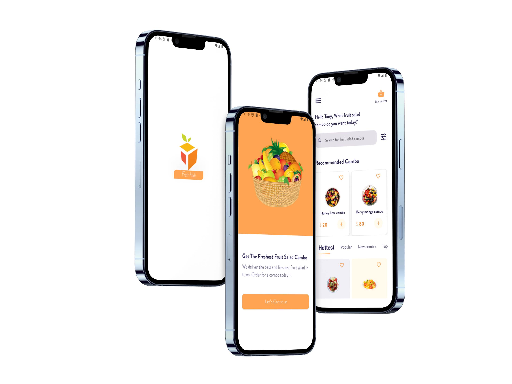
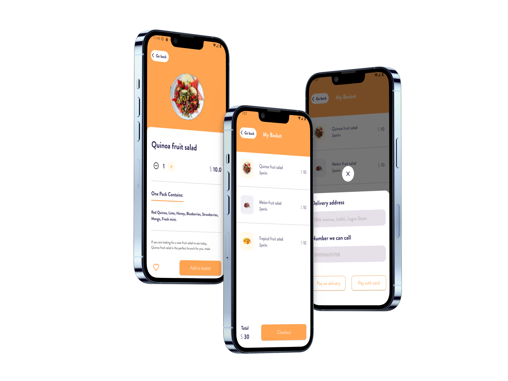

# fruit_hub

## Overview
Fruit Hub is a Flutter mobile application that delivers fresh fruit salad combos. It features a beautifully designed UI, interactive product lists, and smooth navigation for an enjoyable user experience.

## Features
- Splash and Welcome screens with smooth transitions.
- Home screen with search and recommended product lists.
- Tabbed sections: Hottest, Popular, New Combo, and Top products.
- Product detail screens with quantity selection and total price calculation.
- Add to basket functionality.
- Custom reusable widgets for buttons, text fields, and cards.

## Packages Used
- `flutter/material.dart` - Core Flutter package.
- `gap` - For adding spacing between widgets.
- `intl` - For number formatting.

## Folder Structure
```
/lib
  /core
    /constants - App fonts and images
    /functions - Navigation helpers
    /text - Text styles
    /utils - Colors
    /widgets - Reusable widgets like buttons and text fields
  /features
    /home - Home screen, product models, and widgets
    /details - Product details screen
    /welcome - Welcome screen
  /splash - Splash screen
main.dart
```

## Main Widgets
- **SplashScreen** - Displays app logo and navigates to WelcomeScreen.
- **WelcomeScreen** - Introduction screen with navigation to HomeScreen.
- **HomeScreen** - Shows recommended products, tabbed sections, and search.
- **DetailsScreen** - Displays product details, quantity selector, and total price.
- **ProductCard & RecommendedCard** - Custom cards to display products.
- **MainButton** - Reusable button widget.
- **CustomeTextField** - Custom input field.

## Models
- **ProductModel** - Represents a general product.
- **MenuProduct** - Represents menu items.
- **RecommendedProduct** - Represents recommended products with optional description.

## How to Run
1. Clone the repository:
   ```
   git clone <https://github.com/Moataz-Elgazzar/Fruit-Hub.git>
   ```
2. Navigate to project directory:
   ```
   cd fruit_hub
   ```
3. Get packages:
   ```
   flutter pub get
   ```
4. Run the app:
   ```
   flutter run
   ```

## Customization
- Update images in `assets/images` and include them in `pubspec.yaml`.
- Modify colors in `AppColors` and fonts in `AppFonts`.
- Add new products to `product`, `hottestProducts`, `popularProducts`, `newComboProducts`, or `topProducts` lists.

## Notes
- Ensure all images are added to `pubspec.yaml`.
- Quantity and price calculations are dynamic.
- The app uses `pushTo`, `pop`, `pushWithReplacement`, and `pushAndRemoveUntil` functions for navigation.


📸 Screenshots
 
  ,   ,
 


---
**Author:** Moataz Mahmoud
